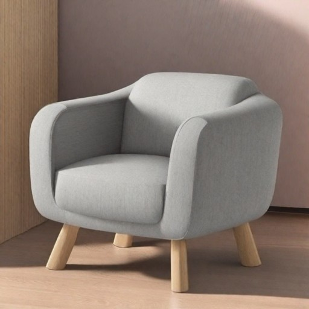

# furniture-generation
Finetuning Stable Diffusion v2.1 to generate aesthetic furniture.

There are a lot of images in the [report](answers.pdf).

https://huggingface.co/Arkan0ID/furniture-model-sd-2-1-200

https://huggingface.co/Arkan0ID/furniture-model-sd-2-1-3600

https://huggingface.co/Arkan0ID/furniture-model-sd-2-1-4200 (best)

https://huggingface.co/Arkan0ID/furniture-model-sd-2-1-5000

https://www.kaggle.com/datasets/dmitryvinnik/furniture

https://www.kaggle.com/datasets/dmitryvinnik/furniture-full
